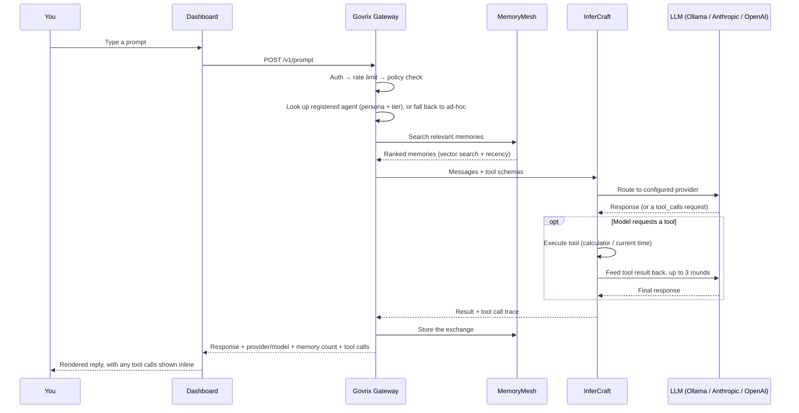
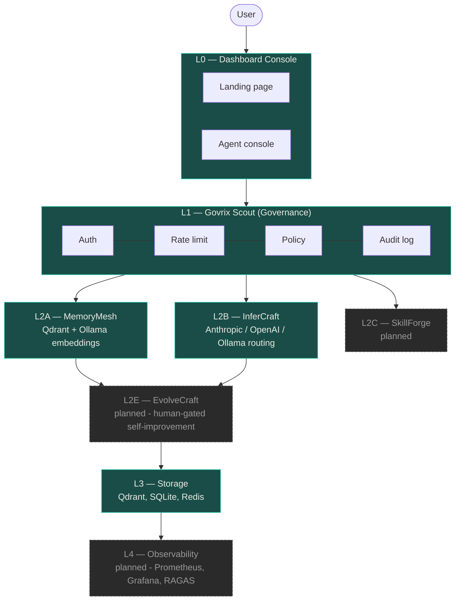

<div align="center">

# AgentOS

**A self-hosted operating system for autonomous AI agents.**

Governance, memory, inference routing, and observability as isolated, swappable
services — the same way AWS gives cloud apps compute, storage, and networking as
separate primitives, instead of one monolithic chatbot.

[](LICENSE)
[](gateway/requirements.txt)
[](dashboard/package.json)
[](dashboard/package.json)
[](gateway/requirements.txt)
[](docs/ROADMAP.md)

[Quick Start](#-quick-start) · [Architecture](#-architecture) · [Live Demo Flow](#-see-it-work) · [Roadmap](#-roadmap) · [Docs](docs/ARCHITECTURE.md) · [Demo Script](docs/DEMO.md)

</div>

---

## Why this exists

Most "AI agent" projects are a chat UI bolted onto an API call. **AgentOS treats
the agent as an application that needs infrastructure**, not a prompt that needs a
front end:

- 🔒 **Governance is not optional.** Every request — from the dashboard, an agent,
  or the API directly — passes through **Govrix** before it ever reaches an LLM.
  Auth, rate limits, and policy checks aren't middleware you can skip; they're the
  front door, with decisions persisted to a queryable audit log.
- 🧠 **Memory is a real system, not a chat log.** **MemoryMesh** runs a real vector
  index (Qdrant) with real embeddings (Ollama), and memory *kinds* behave
  differently: `working` memory expires, `episodic` memory decays in relevance,
  `semantic`/`long_term` memory doesn't.
- 🔀 **Inference is provider-agnostic.** **InferCraft** routes each prompt to
  whichever provider is configured — Anthropic, OpenAI, or a fully local Ollama
  model — escalating model tier automatically on harder prompts, or to a
  `reasoning` tier whenever tools are in play.
- 🛠️ **Agents can act, not just talk.** Register a named agent with a persona
  and it can call real tools — a calculator, the current time — mid-response,
  with results fed back into the same turn. No `eval()`, no unbounded loops:
  every tool call is sandboxed and capped.
- 🤝 **Evolution is human-gated.** The planned **EvolveCraft** loop watches
  latency, cost, and quality, and proposes changes as a diff. It never applies
  them itself.

## ✨ Quick Start

Requires **Python 3.12+** and **Node 20+**. No Docker, no WSL — everything below
runs natively.

```bash
git clone https://github.com/KushalChunduru/Agent_OS.git
cd Agent_OS
cp .env.example .env
python -m venv .venv
```

<details>
<summary><b>Install dependencies</b> (click to expand — Windows vs. macOS/Linux)</summary>

**Windows:**
```bash
.venv/Scripts/pip install -r gateway/requirements.txt -r memory/requirements.txt
```

**macOS/Linux:**
```bash
.venv/bin/pip install -r gateway/requirements.txt -r memory/requirements.txt
```

</details>

Then run each service in its own terminal:

```bash
cd gateway && ../.venv/Scripts/python -m uvicorn app.main:app --port 8000   # Govrix
```
```bash
cd memory && ../.venv/Scripts/python -m uvicorn app.main:app --port 8001   # MemoryMesh
```
```bash
cd dashboard && npm install && npm run dev                                 # Dashboard
```

| Service | URL |
|---|---|
| 🖥️ Dashboard | http://localhost:3000 |
| 🎛️ Agent Console | http://localhost:3000/console |
| 🛡️ Govrix Gateway | http://localhost:8000/health |
| 🧠 MemoryMesh | http://localhost:8001/health |

<details>
<summary><b>Prefer Docker?</b> (optional path, click to expand)</summary>

```bash
cp .env.example .env
docker compose -f docker/docker-compose.yml up --build
```

</details>

### Get real LLM responses

By default `/v1/prompt` echoes a stub — no LLM is configured yet. InferCraft picks
a provider in this order: **Anthropic** → **OpenAI** → **local Ollama**.

<details open>
<summary><b>🦙 Free & local — Ollama (recommended for trying this out)</b></summary>

1. Install [Ollama](https://ollama.com).
2. Pull a chat model — use the small 1B model on machines with ≤8GB RAM (the
   default 3B model needs ~2GB free RAM and will OOM on constrained systems):
   ```bash
   ollama pull llama3.2:1b
   ```
3. Pull the embedding model MemoryMesh uses for semantic search (tiny, ~45MB):
   ```bash
   ollama pull all-minilm
   ```
4. That's it — the gateway auto-detects Ollama at `http://localhost:11434` and
   picks a chat-capable model automatically (embedding-only models are skipped).
5. First response after a cold start is slow (30–70s on CPU while the model
   loads); it's fast after that while Ollama keeps it warm.

</details>

<details>
<summary><b>💳 Paid — Anthropic or OpenAI</b></summary>

Set `ANTHROPIC_API_KEY` or `OPENAI_API_KEY` in `.env` for faster, higher-quality
responses. See `.env.example` for the full variable list.

</details>

## 🎬 See it work

Open the [Agent Console](http://localhost:3000/console) and send a prompt. Here's
what happens on every request:



Try asking something that references an earlier message — the response will cite
`memories_used: N` in the console, proving retrieval actually happened, not just
a stateless echo. Ask a math question and you'll see a line like
`🔧 calculate(65 * 12) → 780` — the agent actually executed the tool, it didn't
just guess the answer.

## 🏗️ Architecture



**Why layered instead of monolithic?** A single service handling governance,
memory, inference, and monitoring becomes a bottleneck and a single point of
failure. Splitting each concern into its own service means independent scaling
per workload, nothing bypasses governance, and storage backends swap without
touching the services above them. Full breakdown: [docs/ARCHITECTURE.md](docs/ARCHITECTURE.md).

## 📦 What's real vs. planned

| Layer | Status | Notes |
|---|:---:|---|
| L0 Dashboard | ✅ Live | Landing page + agent console, Next.js + Tailwind |
| L1 Govrix (governance) | ✅ Live | Auth, rate limiting, policy checks, SQLite-backed audit log + agent registry |
| L2A MemoryMesh | ✅ Live | Qdrant (embedded/local, no server) + real Ollama embeddings |
| L2B InferCraft | ✅ Live | Routes to Anthropic / OpenAI / Ollama automatically; bounded tool-calling loop (calculator, current time) |
| L2C SkillForge | ⏳ Planned | Mine repeated workflows into reusable skills |
| L2E EvolveCraft | ⏳ Planned | Self-improvement loop — proposes diffs, never auto-applies |
| L3 Storage (full) | 🚧 Partial | Qdrant + SQLite today; TimescaleDB/Neo4j/ScyllaDB as it scales |
| L4 Observability | ⏳ Planned | Prometheus, Grafana, RAGAS, Locust |

## 📁 Repo layout

```
Agent_OS/
├── gateway/     # Govrix — governance & security gateway (FastAPI)
├── memory/      # MemoryMesh — persistent memory service (FastAPI + Qdrant embedded)
├── dashboard/   # L0 console (Next.js + Tailwind) — landing page at /, console at /console
├── docker/      # docker-compose.yml + service Dockerfiles (optional path)
├── docs/        # architecture & roadmap
└── .github/     # CI workflows
```

## 🗺️ Roadmap

Phases 1–3 (core platform, memory & retrieval, multi-agent system) are done.
Full detail, including what changed under the hood and honest caveats on what's
verified live vs. implemented-but-untested, lives in [docs/ROADMAP.md](docs/ROADMAP.md).

<details>
<summary><b>Phases 4–6 at a glance</b></summary>

| Phase | Focus |
|---|---|
| 4 — Skill Management | Skill registry, versioning, human approval workflow |
| 5 — Observability | Prometheus, Grafana, OpenTelemetry, RAGAS, Locust |
| 6 — Improvement Engine | EvolveCraft's MAPE-K loop, diff generation, human-gated deploys |

</details>

## 🛠️ Tech stack

`FastAPI` · `Next.js` · `TailwindCSS` · `Qdrant` · `Ollama` · `SQLite` ·
`Anthropic` · `OpenAI` · `Docker Compose` · `Redis`

## 📄 License

[MIT](LICENSE)
