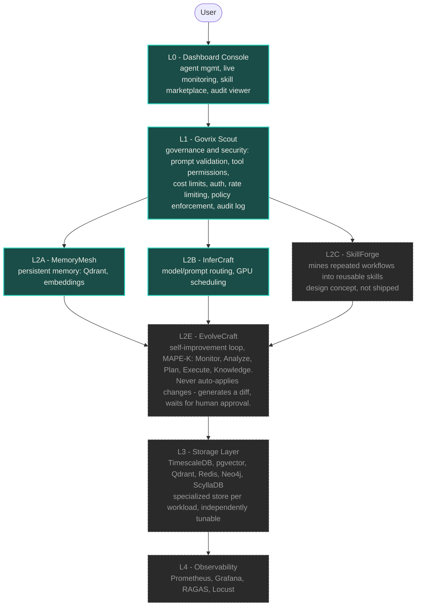

# Architecture

Full target design — most layers beyond Phase 1 + 2 are not yet implemented; see
[what's actually running today](#whats-actually-implemented-today) below and
[ROADMAP.md](ROADMAP.md) for the build order.

*Teal = running code today. Dashed/grey = designed but not yet built.*

## Why layered instead of monolithic

A single database and a single service handling governance, memory, inference, and
monitoring becomes a bottleneck and a single point of failure. Splitting each concern
into its own service means:

- Independent scaling and tuning per workload (vector search vs. time-series vs. cache)
- Nothing can bypass governance — Govrix sits in front of every LLM call
- Storage backends can be swapped without touching the services above them

## What's actually implemented today

**Dashboard**, **Govrix**, **MemoryMesh**, and a minimal **InferCraft** all exist as
running code and work end-to-end natively (no Docker required):

- MemoryMesh uses **Qdrant in embedded/local mode** (in-process, backed by a local
  directory — no server, no Docker) for vector search, and **Ollama (`all-minilm`)**
  for real embeddings, falling back to a hashing approximation if Ollama is
  unreachable. Memory kinds (`working`/`episodic`/`semantic`/`long_term`) have real
  behavior: working memory expires, episodic gets a recency boost in ranking.
- Govrix's `/v1/prompt` route runs auth → rate-limit → policy → MemoryMesh retrieval
  → InferCraft (routes to Anthropic/OpenAI/Ollama, whichever is configured, else a
  labeled stub) → stores the exchange back into memory. Audit decisions persist to
  SQLite, queryable at `GET /v1/audit`.

SkillForge, EvolveCraft, multi-agent orchestration, and the full observability stack
are not started — see [ROADMAP.md](ROADMAP.md).

## Request flow

See the sequence diagram in the [README](../README.md#-see-it-work) for a
step-by-step trace of what happens between typing a prompt and seeing a response,
including exactly where governance, memory retrieval, and provider routing happen.
